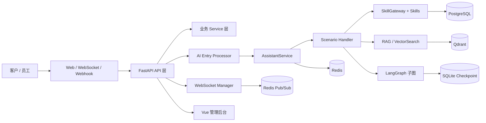
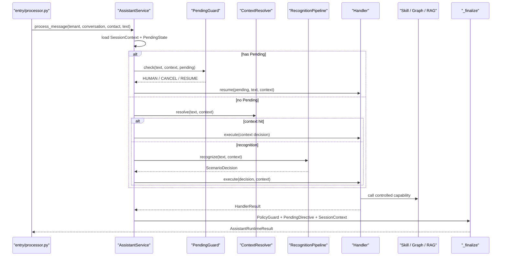

# FastAgent 架构说明
> 更新日期：2026-07-02  
> 本文档描述当前项目的实际架构，包括 Web 后台、AI 对话主链路、状态边界、数据存储、前端结构和可观测性。更细的场景、开发规则、trace 和 Harness 说明见文末关联文档。

---

## 1. 项目定位

FastAgent 是一个面向电商/客服场景的多租户智能客服系统。系统包含三类核心能力：

- 业务后台：租户、员工、权限、客户、会话、商品、订单、知识库、素材、用量等管理。
- 实时工作台：员工通过 WebSocket 接收会话消息，支持 AI 接待、人工接待和人工排队状态。
- AI 助手：基于场景识别、Handler、Skill、RAG、LangGraph 子图完成商品咨询、订单查询/操作、知识问答、记忆和转人工。

---

## 2. 总体架构



主要运行时组件：

| 组件 | 当前实现 | 职责 |
| --- | --- | --- |
| Backend API | `backend/app/main.py` | 注册 HTTP API、WebSocket、CORS、trace 中间件、健康检查和生命周期清理。 |
| AI Entry | `backend/app/ai/entry/processor.py` | 会话状态过滤、人工排队处理、调用 `AssistantService`、落库并广播 AI 回复。 |
| Assistant | `backend/app/ai/assistant/service.py` | AI 主编排：加载状态、处理 Pending、上下文解析、场景识别、Handler 路由、统一收口。 |
| Handler | `backend/app/ai/handlers/*` | 每个场景的确定性业务流程。 |
| Skill | `backend/app/ai/skills/*` | 结构化业务能力，负责读写商品、订单、知识、记忆等数据。 |
| RAG | `backend/app/ai/rag/*` | 文档解析、切块、embedding、向量检索。 |
| Frontend | `frontend/src/*` | Vue 3 管理后台、实时工作台、数据管理页面。 |
| Infrastructure | `docker-compose.yml` | PostgreSQL/pgvector、Redis、Qdrant、Backend 本地编排。 |

---

## 3. 代码结构

```text
backend/app/
  main.py                         # FastAPI 应用入口
  config.py                       # 环境变量配置
  api/v1/                         # REST API 与 WebSocket 路由
  models/                         # SQLAlchemy ORM 模型
  schemas/                        # API DTO / Pydantic schema
  services/                       # 业务服务层
  integrations/                   # DB、Redis、Qdrant、LLM、Embedding、WeCom 等外部集成
  common/                         # trace、日志、错误码、常量、枚举
  core/                           # 安全、WebSocket 管理等核心工具
  ai/
    entry/                        # 入站消息处理管线
    assistant/                    # AI 主编排、PendingGuard、运行结果
    recognition/                  # 场景识别、强规则、向量样本召回、LLM 精判
    scenario/                     # ScenarioSpec 与 PolicyGuard
    handlers/                     # Product/Order/Knowledge/Memory/Human/Template Handler
    components/                   # 商品/订单引用解析、状态解析、抽取器等可复用组件
    skills/                       # 商品、订单、知识、记忆 Skill
    graphs/                       # order.create / order.cancel / order.refund LangGraph 子图
    rag/                          # 知识库解析、切块、embedding、向量检索
    reply_builders/               # 各领域回复构造
    prompts/                      # 场景识别、商品抽取、知识摘要、记忆等 Prompt

frontend/src/
  api/                            # Axios API 封装
  components/                     # 业务组件
  composables/                    # WebSocket 等组合式逻辑
  layouts/                        # 后台布局
  router/                         # Vue Router
  stores/                         # Pinia 状态
  views/                          # 工作台、商品、订单、知识、设置、平台管理等页面
```

---

## 4. 后端分层

后端采用典型的 API -> Service -> Model/Integration 分层，AI 对话链路作为独立子系统嵌入业务服务。

| 层级 | 目录 | 规则 |
| --- | --- | --- |
| API | `app/api/v1` | 处理鉴权、请求 DTO、响应 DTO，不承载复杂业务。 |
| Service | `app/services` | 承载业务规则、数据库查询、领域状态变更。 |
| Model | `app/models` | SQLAlchemy ORM，按业务域拆分。 |
| Schema | `app/schemas` | REST API 输入输出结构。 |
| Integration | `app/integrations` | 外部系统适配，不把外部协议泄漏到业务层。 |
| AI | `app/ai` | 独立的对话编排、识别、Handler、Skill、RAG 和图流程。 |
| Common/Core | `app/common`、`app/core` | trace、日志、常量、安全、WebSocket 等基础设施。 |

内部/调试 API 只在 `APP_ENV=development` 或 `APP_ENV=test` 时注册，包括 Harness 和 WebTest。

---

## 5. AI 对话主链路

当前 AI 链路不是一个通用 Agent 自动规划器，而是“场景识别 + 确定性 Handler + 受控 Skill”的架构。



关键边界：

- `RecognitionPipeline` 只输出 `scenario_id`、置信度和粗实体，不直接查业务对象。
- `ContextResolver` 只处理序号、指代和省略型上下文，不处理 Pending。
- Handler 是场景流程负责人，决定调用哪些 Skill、是否查询知识、是否进入 LangGraph。
- Skill 只接收结构化参数，不做意图识别。
- `_finalize()` 是唯一收口点，负责权限校验、Pending 持久化、SessionContext 保存和结果组装。

---

## 6. 场景与 Handler

当前场景以 `ScenarioSpec` 和 `HandlerRegistry` 为准。主要领域如下：

| 领域 | 场景数量 | Handler | 说明 |
| --- | ---: | --- | --- |
| 商品 | 9 | `ProductHandler` | 分类浏览、条件筛选、语义推荐、SKU、详情、属性、用法、对比、翻页排序。 |
| 订单 | 8 | `OrderHandler` | 订单列表/筛选/详情/物流，以及下单、取消、确认、售后图流程。 |
| 知识 | 3 | `KnowledgeHandler` | 通用 QA、政策咨询、商品知识问答。 |
| 记忆 | 2 | `MemoryHandler` | 保存和召回客户偏好。 |
| 模板 | 6 | `TemplateHandler` | 问候、确认、告别、空消息、兜底、澄清。 |
| 人工 | 1 | `HumanHandler` | 转人工信号，交给会话处理层更新人工状态。 |

`PolicyGuard` 会在 `_finalize()` 中根据 `ScenarioSpec` 校验：

- Handler 是否调用了未允许的 Skill。
- `read_only` 场景是否触发写 Skill 或设置 Pending。
- `human_required` 场景是否绕过人工处理。
- LLM、向量检索和 Pending 是否符合场景许可。

更细的场景说明见 [`requirements/scenarios.md`](requirements/scenarios.md)。

---

## 7. 状态边界

系统有三类对话状态，边界必须保持清晰。

| 状态 | 存储 | 当前用途 |
| --- | --- | --- |
| `SessionContext` | Redis | 普通短期上下文：商品候选、焦点商品、最近订单、知识引用、人工审批提示等。 |
| `PendingState` | Redis | LangGraph 恢复信封：`scenario_id`、`step`、`graph_thread_id`、`interrupt_id`。 |
| LangGraph checkpoint | SQLite checkpoint | 复杂订单图的业务进度，例如下单、取消、售后流程中的中断状态。 |

设计规则：

- 商品候选和知识追问引用放在 `SessionContext`。
- 订单图的业务进度放在 LangGraph checkpoint。
- Redis `PendingState` 只保存恢复图所需的索引，不复制 SKU、地址、确认状态等业务数据。
- 有 Pending 时先经过 `PendingGuard`，顺序是转人工 -> 取消 -> 恢复。
- 转人工、流程完成或用户取消时返回 `PendingDirective.CLEAR`。

---

## 8. 数据与外部依赖

| 依赖 | 当前用途 | 接入位置 |
| --- | --- | --- |
| PostgreSQL / pgvector | 主业务数据：租户、员工、客户、会话、商品、订单、知识、QA、素材、用量等。 | `app/integrations/database.py` |
| Redis | SessionContext、PendingState、WebSocket pub/sub、部分运行时缓存。 | `app/integrations/redis_client.py`、`app/core/websocket_manager.py` |
| Qdrant | 意图样本、知识块、QA、商品、营销文档、图片等向量集合。 | `app/integrations/qdrant_client.py` |
| Embedding 服务 | 文本向量化。 | `app/integrations/embedding_client.py` |
| LLM 服务 | 场景精判、商品抽取、知识摘要、回复组织等受控调用。 | `app/ai/llm/gateway.py`、`app/integrations/llm_client.py` |
| LangFuse | 可选观测：LLM、向量、SQL、图节点 span。 | `app/ai/observability.py` |
| WeCom | 企业微信渠道配置与出站消息。 | `app/integrations/wecom*.py` |

本地开发 `docker-compose.yml` 启动 PostgreSQL/pgvector、Redis、Qdrant 和 Backend。Frontend 当前通过 Vite 独立启动。

---

## 9. 知识库与向量检索

知识链路分为写入和检索两部分：

```text
文档/QA/商品知识上传
  -> parser / chunker
  -> embedding
  -> Qdrant upsert
  -> PostgreSQL 保存业务元数据

用户知识问题
  -> scenario=knowledge.* 或 product.detail/product.usage 知识增强
  -> search_qa / search_knowledge / search_product_knowledge
  -> 短内容直出或 LLM 摘要
  -> 保存 last_knowledge_refs 支持追问
```

约束：

- 知识回答必须来自 QA 或知识分块命中，不用 LLM 编造事实。
- 商品详情/用法类问题要先确定 `product_id`，再检索该商品相关知识。
- 向量集合通过统一 `VectorSearchService` 和 Qdrant 集成访问，业务代码不直接拼 Qdrant HTTP 请求。

---

## 10. 实时消息与人工接待

实时消息链路由 REST、WebSocket、Redis pub/sub 和会话服务共同组成。

```text
客户消息入站
  -> conversations/webhooks 写入 Message
  -> process_customer_message_with_ai
  -> AssistantService 生成回复
  -> AI 回复落库
  -> WebSocket Manager publish
  -> 前端工作台实时显示
```

人工相关规则：

- 会话关闭、人工接待中、非客户文本消息不会进入 AI 主编排。
- `human.transfer` 只产生转人工信号，真正的会话状态变更由 `entry/processor.py` 消费 `context_update` 后完成。
- Pending 人工排队状态下，客户可以回复“智能客服”切回 AI。
- WebSocket 使用 query token 鉴权，按 `conversation_id` 建立频道。
- 多实例广播通过 Redis pub/sub；Redis 不可用时降级为本实例本地广播。

---

## 11. 前端架构

前端是 Vue 3 + Vite + TypeScript + Element Plus。

| 模块 | 目录 | 说明 |
| --- | --- | --- |
| API | `frontend/src/api` | Axios 封装，统一 `/api/v1` baseURL 和 JWT。 |
| Router | `frontend/src/router` | 后台路由、公开路由、超级管理员路由守卫。 |
| Store | `frontend/src/stores` | Pinia 管理登录态和权限。 |
| Workbench | `frontend/src/views/workbench`、`components/workbench` | 会话工作台、消息列表、实时消息展示。 |
| Business Views | `frontend/src/views/*` | 商品、订单、客户、知识库、平台管理、设置、用量等页面。 |
| WebSocket | `frontend/src/composables/useWebSocket.ts` | 会话级 WebSocket 连接、心跳、重连和消息分发。 |

前端通过相对路径访问后端：

- HTTP：`/api/v1`
- WebSocket：`/ws/{conversation_id}?token=...`

---

## 12. 可观测性

当前可观测性分为请求级 trace_id 和 AI/依赖调用观测。

- HTTP 请求由 `TraceIdMiddleware` 设置或继承 `X-Trace-Id`。
- WebSocket 连接在 `ws.py` 中建立连接级 trace_id。
- AI 主链路通过 `observe_trace` 和 `observe_span` 记录时序。
- LLM、向量、外部 HTTP、SQLAlchemy SQL 执行都有观测封装。
- `SkillGateway` 会把 Skill 调用写入 `ResourceTrace`。
- `AssistantRuntimeResult.metadata.resource_trace` 会进入 AI 回复 metadata，供调试和 Harness 断言。
- LangFuse 是可选集成，未启用时仍保留结构化日志。

详细说明见 [`development/observability.md`](development/observability.md)。

---

## 13. 开发与验证

常用验证入口：

| 类型 | 命令/入口 |
| --- | --- |
| 后端测试 | 在 `backend` 下运行 `uv run pytest` 或指定测试文件。 |
| 前端构建 | 在 `frontend` 下运行 `npm run build`。 |
| 本地基础设施 | 根目录 `docker compose up -d postgres redis qdrant`。 |
| Harness | `backend/tests/harness` 和 `docs/evaluation/harness.md`。 |
| 健康检查 | `GET /health` 返回 DB 和 Redis 状态。 |

架构变更需要同步检查：

- 是否新增/修改了 `ScenarioSpec` 和 Handler 注册。
- 是否改变了 `SessionContext`、`PendingState` 或 LangGraph checkpoint 边界。
- 是否新增了 Skill 写操作，并同步写 Skill 集合和权限校验。
- 是否影响 WebSocket、人工接待、AI 回复 metadata 或 Harness 断言。

---

## 14. 关联文档

| 文档 | 内容 |
| --- | --- |
| [`requirements/scenarios.md`](requirements/scenarios.md) | 当前场景需求、识别规则、Handler 边界和回归重点。 |
| [`development/standards.md`](development/standards.md) | 开发规则、行为规则、目录职责和边界约束。 |
| [`development/observability.md`](development/observability.md) | trace_id、日志、LangFuse、ResourceTrace 和观测边界。 |
| [`evaluation/harness.md`](evaluation/harness.md) | Harness 回归测试使用说明。 |
